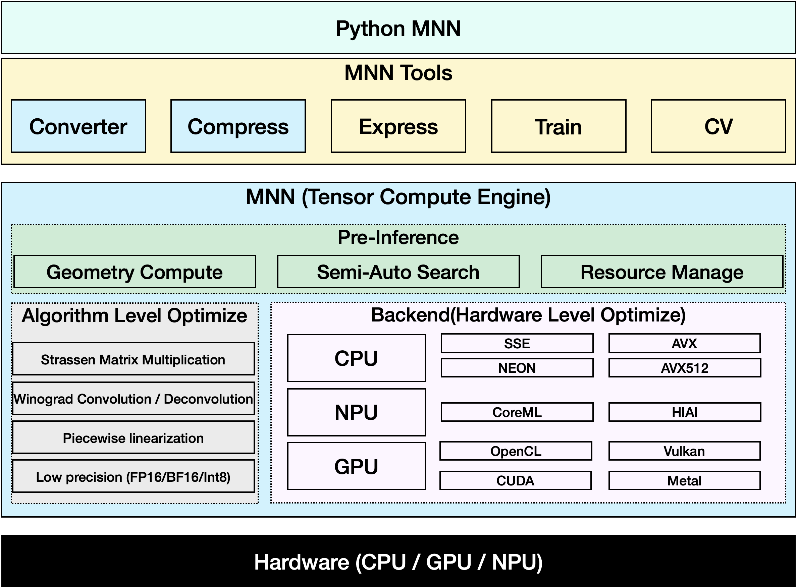

[English Version](README.md)

## 简介
MNN是一个轻量级的深度神经网络推理引擎，在端侧加载深度神经网络模型进行推理预测。目前，MNN已经在阿里巴巴的手机淘宝、手机天猫、优酷等20多个App中使用，覆盖直播、短视频、搜索推荐、商品图像搜索、互动营销、权益发放、安全风控等场景。此外，IoT等场景下也有若干应用。

## 整体特点
### 轻量性
- 针对端侧设备特点深度定制和裁剪，无任何依赖，可以方便地部署到移动设备和各种嵌入式设备中。
- iOS平台：armv7+arm64静态库大小5MB左右，链接生成可执行文件增加大小620KB左右，metallib文件600KB左右。
- Android平台：so大小400KB左右，OpenCL库400KB左右，Vulkan库400KB左右。

### 通用性
- 支持`Tensorflow`、`Caffe`、`ONNX`等主流模型文件格式，支持`CNN`、`RNN`、`GAN`等常用网络。
- 支持86个`Tensorflow`Op、34个`Caffe`Op；各计算设备支持的MNN Op数：CPU 71个，Metal 55个，OpenCL 29个，Vulkan 31个。
- 支持iOS 8.0+、Android 4.3+和具有POSIX接口的嵌入式设备。
- 支持异构设备混合计算，目前支持CPU和GPU，可以动态导入GPU Op插件，替代CPU Op的实现。

### 高性能
- 不依赖任何第三方计算库，依靠大量手写汇编实现核心运算，充分发挥ARM CPU的算力。
- iOS设备上可以开启GPU加速（Metal），常用模型上快于苹果原生的CoreML。
- Android上提供了`OpenCL`、`Vulkan`、`OpenGL`三套方案，尽可能多地满足设备需求，针对主流GPU（`Adreno`和`Mali`）做了深度调优。
- 卷积、转置卷积算法高效稳定，对于任意形状的卷积均能高效运行，广泛运用了 Winograd 卷积算法，对3x3 -> 7x7之类的对称卷积有高效的实现。
- 针对ARM v8.2的新架构额外作了优化，新设备可利用半精度计算的特性进一步提速。

### 易用性
- 有高效的图像处理模块，覆盖常见的形变、转换等需求，一般情况下，无需额外引入libyuv或opencv库处理图像。
- 支持回调机制，可以在网络运行中插入回调，提取数据或者控制运行走向。
- 支持只运行网络中的一部分，或者指定CPU和GPU间并行运行。

## 架构设计

MNN可以分为Converter和Interpreter两部分。

Converter由Frontends和Graph Optimize构成。前者负责支持不同的训练框架，MNN当前支持Tensorflow(Lite)、Caffe和ONNX(PyTorch/MXNet的模型可先转为ONNX模型再转到MNN)；后者通过算子融合、算子替代、布局调整等方式优化图。

Interpreter由Engine和Backends构成。前者负责模型的加载、计算图的调度；后者包含各计算设备下的内存分配、Op实现。在Engine和Backends中，MNN应用了多种优化方案，包括在卷积和反卷积中应用Winograd算法、在矩阵乘法中应用Strassen算法、低精度计算、Neon优化、手写汇编、多线程优化、内存复用、异构计算等。

## 开始使用
- [使用方法](https://www.yuque.com/mnn/cn/usage)
- [算子列表](https://www.yuque.com/mnn/en/ops)
- [API文档](doc/API/API_index.html)
- [示例](https://www.yuque.com/mnn/cn/demo_zoo)

## 工具
- [测试工具](https://www.yuque.com/mnn/cn/tool_test)
- [性能测试](https://www.yuque.com/mnn/cn/tool_benchmark)
- [模型压缩](https://www.yuque.com/mnn/cn/tool_quantize)
- [基于表达式构建模型并评测](benchmark/Readme_CN.md)

## 如何修改
- [自定义后端](https://www.yuque.com/mnn/cn/customize_backend)
- [自定义算子](https://www.yuque.com/mnn/cn/customize_op)
- [贡献代码](https://www.yuque.com/mnn/cn/contribute)

## 如何使用Python
- [Python](https://www.yuque.com/mnn/cn/usage_in_python)

##  交流与反馈
- [常见问题](https://www.yuque.com/mnn/en/faq)

扫描二维码加入钉钉讨论群。

## License
Apache 2.0

## 致谢
MNN参与人员：淘宝技术部、搜索工程团队、达摩院团队、优酷等集团员工。

MNN参考、借鉴了下列项目：
- [Caffe](https://github.com/BVLC/caffe)
- [flatbuffer](https://github.com/google/flatbuffers)
- [gemmlowp](https://github.com/google/gemmlowp)
- [Google Vulkan demo](http://www.github.com/googlesamples/android-vulkan-tutorials) 
- [Halide](https://github.com/halide/Halide)
- [Mace](https://github.com/XiaoMi/mace)
- [ONNX](https://github.com/onnx/onnx)
- [protobuffer](https://github.com/protocolbuffers/protobuf)
- [skia](https://github.com/google/skia)
- [Tensorflow](https://github.com/tensorflow/tensorflow)
- [ncnn](https://github.com/Tencent/ncnn)
- [paddle-mobile](https://github.com/PaddlePaddle/paddle-mobile)
- [stb](https://github.com/nothings/stb)
- [rapidjson](https://github.com/Tencent/rapidjson)
